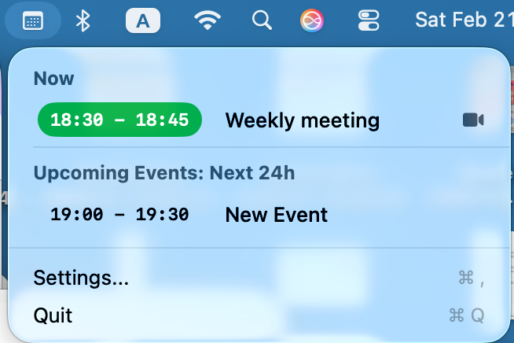
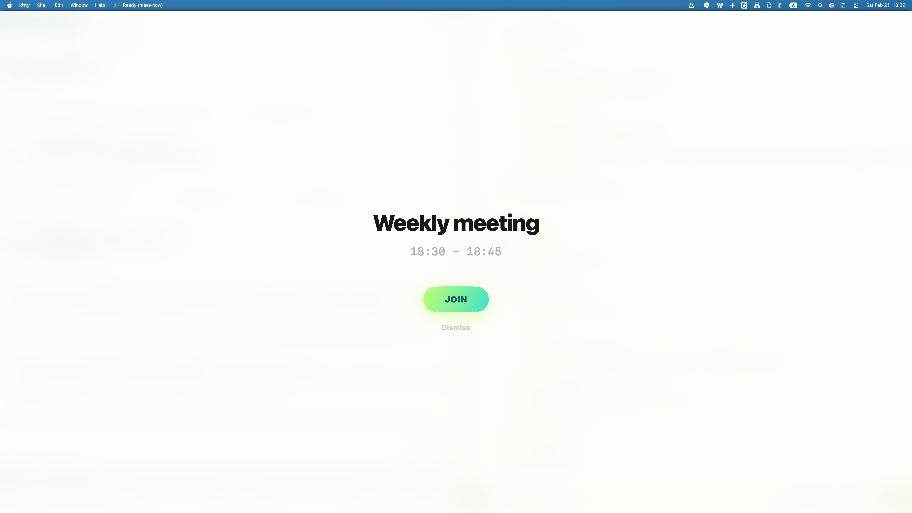

# MeetNow

**MeetNow** is a minimalist macOS menu-bar application designed to ensure you never miss a meeting. It monitors your calendar and displays a high-impact, full-screen overlay minutes before your next meeting starts, providing a single, focused button to join immediately.




## ✨ Features

- **Menu Bar Access**: View your current and upcoming events for the next 24 hours at a glance.
- **High-Impact Overlays**: A beautiful, semi-transparent full-screen overlay triggers before meetings to grab your attention.
- **Smart Link Extraction**: Automatically detects meeting links from event notes, locations, or dedicated URL fields for:
  - Google Meet
  - Zoom
  - Microsoft Teams
  - WebEx
- **Customizable Reminders**: Set how many minutes before an event you want to be notified (0–15 mins).
- **Deep Integration**: Built with `EventKit` for native macOS calendar performance and `Combine` for reactive UI updates.

## 🚀 Getting Started

### Development

To fully support macOS permissions (Calendar access) and the Menu Bar UI, it is recommended to run the app via Xcode:

1. Open the project folder in **Xcode**.
2. Press `Cmd + R` to Build and Run.

### Manual Installation

1.  **Build and Install**: Run this command in your terminal from the project root:
    ```bash
    swift build -c release && ./scripts/install.sh .build/release/MeetNow
    ```
    *This automatically builds an optimized release version and installs it to `/Applications/MeetNow.app`.*
2.  **Open**: Right-click `/Applications/MeetNow.app` and select **Open** for the first time.

### CLI Usage

MeetNow can be managed entirely from the terminal:

- **Launch the app**: `open -a MeetNow`
- **Quit the app**: `pkill MeetNow`
- **View reminder setting**: `defaults read com.meetnow.app reminderOffset`
- **Update reminder setting** (e.g., to 10m): `defaults write com.meetnow.app reminderOffset -float 10.0`

## 🛠 Tech Stack

- **SwiftUI**: Modern, declarative UI for the menu bar and settings.
- **AppKit (Cocoa)**: Low-level window management for the full-screen overlay.
- **EventKit**: Native calendar event synchronization.
- **Combine**: Reactive data flow for event updates and window lifecycle.
- **Swift Regex**: Native regex for high-performance meeting link extraction.

## 🧪 Testing

The core meeting link extraction logic is covered by unit tests. Run them using:
```bash
swift test
```

## 🛡 Security & Privacy

MeetNow runs entirely locally. It requests access to your calendar to fetch meeting details and never transmits your data to any external server. Link extraction happens purely on-device using regex patterns.
